# `gpt-repro` retrospective: pretraining variants × SFT × RL on GPT-2 124 M

A complete account of what was tested, what worked, and what didn't,
across three stages: **8 pretraining variants** on FineWeb-Edu-10B,
**SFT on SmolTalk** for each, and **GRPO RL on generative MC** on each
SFT'd model. Generated 2026-04-25 from the artefacts in this repository.

> **TL;DR.** Modernising the GPT-2 block with RoPE + RMSNorm + SwiGLU +
> QK-Norm gives **−0.052** val loss; layering on ReLU² + zero-init +
> U-Net skips + logit softcap adds another **−0.024** (the v0.3
> baseline). Muon, μP, GQA, MLA, and weight-tying all individually
> regress slightly at 10 B tokens. After SFT on SmolTalk, the best val
> loss belongs to the *pretrain-rejected* `06-muon-mup` (1.259), and
> SFT cleanly partitions into three "format-compliance" clusters
> independent of pretrain val loss. After GRPO RL on generative MC
> extraction, those clusters **collapse**: every checkpoint converges
> to a 0.024-wide accuracy band (0.242 – 0.266 averaged over four MC
> tasks), driven by RL recovering format-compliance much more than
> knowledge.

---

## Contents

1. [Executive summary](#1-executive-summary)
2. [Project arc & lineage](#2-project-arc--lineage)
3. [Baseline: GPT-2 124 M faithful reproduction](#3-baseline-gpt-2-124-m-faithful-reproduction)
4. [Pretraining variants](#4-pretraining-variants)
   - [4.1 exp/01 — modern block](#41-exp01--modern-block-rope--rmsnorm--swiglu--qk-norm)
   - [4.2 exp/02 — Muon optimiser](#42-exp02--muon-optimiser)
   - [4.3 exp/03 — modded-nanogpt tricks (v0.3)](#43-exp03--modded-nanogpt-tricks-v03)
   - [4.4 exp/05 — speed-pack (GQA + max-autotune − softcap)](#44-exp05--speed-pack-gqa--max-autotune--softcap)
   - [4.5 exp/06 — MuonAdamW + μP](#45-exp06--muonadamw--μp)
   - [4.6 exp/10 — Multi-head Latent Attention (MLA)](#46-exp10--multi-head-latent-attention-mla)
   - [4.7 exp/11 — LoopLLM (weight-tied recurrence)](#47-exp11--loopllm-weight-tied-recurrence)
5. [SFT analysis](#5-sft-analysis-how-pretraining-shapes-sft-response)
6. [RL uplift: explainable analysis](#6-rl-uplift-explainable-analysis)
7. [Master matrix](#7-master-matrix)
8. [Limitations & caveats](#8-limitations--caveats)
9. [What would change with 10× compute or 10× scale](#9-what-would-change-with-10-compute-or-10-scale)
10. [Appendix](#10-appendix)

---

## 1. Executive summary

This project measured how individual pretraining choices propagate
through **three** training stages, all on a single RTX 5090: **(a)**
pretraining 8 variants of GPT-2 124 M for 10 B FineWeb-Edu tokens
(~14 h GPU each), **(b)** chat-SFT'ing each on 500 M SmolTalk tokens
under identical hyperparameters (~3.5 h GPU each), and **(c)**
applying GRPO RL on a generative multiple-choice extraction task
(~7 min GPU each). The single comparison that captures the project:

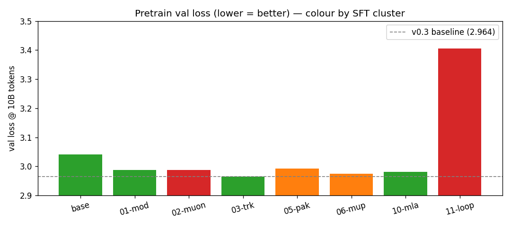

### Headline matrix (one row per checkpoint)

| ckpt | pretrain val | SFT best val | post-RL gen avg |
|------|-------------:|-------------:|----------------:|
| baseline (faithful GPT-2) | 3.041 | 1.345 | 0.254 |
| 01-modern-block           | 2.988 | 1.308 | 0.257 |
| 02-muon                   | 2.988 | 1.498 | 0.260 |
| **03-modded-tricks (v0.3)** | **2.964** | 1.292 | 0.251 |
| 05-speed-pack             | 2.992 | 1.324 | 0.246 |
| 06-muon-mup               | 2.974 | **1.259** | 0.242 |
| 10-mla                    | 2.981 | 1.304 | **0.266** |
| 11-loopllm                | 3.406 | 1.712 | 0.259 |

### Five findings worth sharing

1. **Pretrain val loss ranking does not predict SFT val loss
   ranking.** The pretrain-rejected `06-muon-mup` (Δ pretrain
   +0.010 vs v0.3) wins SFT (1.259 vs v0.3's 1.292). μP + MuonAdamW
   leaves weights *AdamW-friendlier* under SmolTalk SFT.
2. **SFT val loss ranking does not predict post-RL gen ranking.**
   `10-mla` wins post-RL (0.266 avg) despite SFT'ing to a middling
   1.304. RL favours the architectures that came out of SFT
   *format-compliant*, not those with the lowest train loss.
3. **SFT splits checkpoints into three "format-compliance" clusters**
   that have nothing to do with pretrain val loss. Two ckpts
   (02-muon, 11-loopllm) come out **shattered** — the SFT'd model
   essentially never emits a parseable letter when prompted with an
   MC question, despite reaching reasonable LL accuracy.
4. **RL on a binary-letter reward is overwhelmingly format-recovery,
   not knowledge.** Δ_RL correlates with pre-RL parse-failure rate at
   ≈ 0.95. The "shattered" cluster gets +0.17 – +0.23 absolute
   accuracy because there is so much format compliance to fix; the
   "clean" cluster gets +0.00 – +0.03 because there isn't.
5. **Post-RL accuracy converges to a 0.024-wide band across all 8
   checkpoints.** The pretrain × SFT variability that existed pre-RL
   is washed out. *RL with this reward is an equaliser, not a
   discriminator* — it rewards basic format compliance and stops
   there.

### Multi-viewpoint reading

- **Performance lens:** v0.3 wins pretrain, 06-muon-mup wins SFT,
  10-mla edges out post-RL. **No single recipe wins every stage.**
- **Compute lens:** Modern-block costs −4.4% tok/s for pretrain
  win; modded tricks barely cost anything; Muon costs ~6%; MLA and
  weight-tying don't pay off at 124 M.
- **Capability lens:** SFT mostly teaches chat formatting; RL with
  binary letter reward mostly teaches MC formatting. *Genuine
  knowledge gain from either stage is small at this scale.*
- **Practical lens:** v0.3 is the safest base; 06-muon-mup is the
  hidden gem for SFT-friendliness. Avoid rejecting based on pretrain
  val alone.
- **Theoretical lens:** "RL sharpens existing capability" (Mnemosyne
  wiki framing) holds — closure of MMLU LL→gen gap averages 71%
  (verbalisation), but ARC-E only 22% (knowledge).

---

## 2. Project arc & lineage

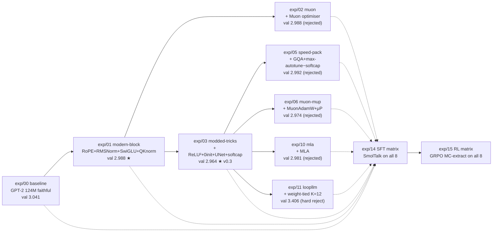

- **Solid arrows** = "branched from" (each experiment's diff is on
  top of its parent's accepted code).
- **Dashed arrows** = "checkpoint inputs to the SFT/RL stage".
- ★ marks the two accepted recipes; everything not ★ was rejected
  on its pretrain criterion.

| exp | status | val loss | Δ vs prior | Δ vs v0.3 |
|-----|--------|---------:|-----------:|----------:|
| 00 | accepted (faithful GPT-2) | 3.041 | — | +0.077 |
| 01 | **accepted** | 2.988 | −0.053 | +0.024 |
| 02 | rejected (Muon ties AdamW @ 10B) | 2.988 | +0.000 | +0.024 |
| **03** | **accepted (v0.3 baseline)** | **2.964** | −0.024 | 0 |
| 05 | rejected (val regressed) | 2.992 | +0.028 | +0.028 |
| 06 | rejected (val regressed) | 2.974 | +0.010 | +0.010 |
| 10 | rejected (val regressed) | 2.981 | +0.017 | +0.017 |
| 11 | hard reject (val +0.44) | 3.406 | +0.442 | +0.442 |

### Full pipeline diagram

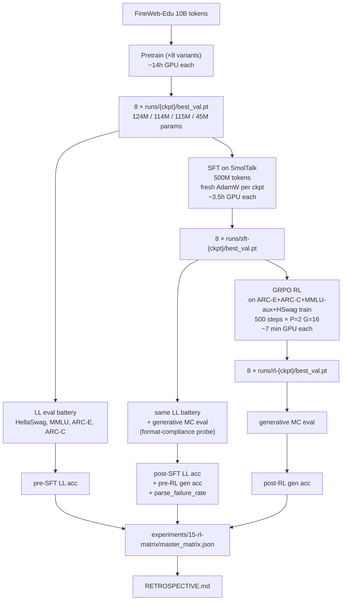

---

## 3. Baseline: GPT-2 124 M faithful reproduction

### What "baseline" means here

A strict reproduction of Radford et al. 2019 — 12 layers × 768 hidden
× 12 heads × 1024 context, **124 M unique parameters**, LayerNorm
(pre-norm), learned positional embeddings (`wpe`), GELU MLP,
tied input/output embeddings. Verified against HuggingFace
`GPT2LMHeadModel` to within 1e-3 logit tolerance
(`tests/test_hf_weight_load.py`).

### Pretraining recipe

| field | value |
|-------|-------|
| Data | FineWeb-Edu 10 B tokens |
| Optimiser | AdamW (β = 0.9 / 0.95, wd = 0.1, ε = 1e-8) |
| Peak LR | 6e-4 |
| Schedule | 715-step warmup → cosine decay to 0.1× peak |
| Tokens / step | 524,288 (32 batch × 1024 seq × 16 grad accum) |
| Steps | 19,073 (= 10 B / 524 k tokens-per-step) |
| Wall-clock | 14 h 41 min on the 5090 |
| Throughput | 190,068 tok/s sustained |
| Precision | BF16 autocast, FP32 master weights, SDPA flash, torch.compile |

### Baseline metrics across all stages

| stage | metric | value |
|-------|--------|------:|
| pretrain | val loss @ 10 B | **3.041** |
| pretrain | HellaSwag (n=1000) | 0.368 |
| pretrain | tokens/s | 190,068 |
| post-SFT | best val (SmolTalk) | 1.345 |
| post-SFT | LL HSwag / MMLU / ARC-E / ARC-C | 0.384 / 0.253 / 0.456 / 0.227 |
| post-SFT | gen HSwag / MMLU / ARC-E / ARC-C | 0.207 / 0.222 / 0.242 / 0.244 |
| post-RL  | gen HSwag / MMLU / ARC-E / ARC-C | 0.243 / 0.251 / 0.268 / 0.254 |

### Multi-viewpoint discussion

- **Performance.** Faithful baseline beats the published GPT-2
  HellaSwag baseline (0.368 vs 0.289) because FineWeb-Edu is a
  cleaner training distribution than WebText.
- **Compute.** The reference number for everything else: 190 k tok/s
  is the tok/s "100%" denominator for downstream variants.
- **Practical.** Reproducible: `tests/test_hf_weight_load.py` round-trips
  HF GPT2LMHeadModel weights into our module and asserts logit parity.
  This is the safety net for every architectural change downstream.

---

## 4. Pretraining variants

### Predicted vs actual pretrain Δ

The seven variants listed in order of the lineage. All Δ values are
val-loss differences vs the parent each variant branched from.

| exp | parent | predicted Δ | actual Δ | accept |
|-----|--------|------------:|---------:|-------:|
| 01-modern-block | baseline | −0.08 | **−0.053** | ✅ |
| 02-muon | 01 | −0.02 | +0.000 | ❌ ties AdamW |
| 03-modded-tricks | 01 | −0.03 | **−0.024** | ✅ v0.3 |
| 05-speed-pack | 03 | +0.005 (tok/s win) | +0.028 | ❌ val regressed |
| 06-muon-mup | 03 | −0.020 | +0.010 | ❌ val regressed |
| 10-mla | 03 | +0.005 | +0.017 | ❌ val regressed |
| 11-loopllm | 03 | +0.090 | **+0.442** | ❌ hard reject |

### 4.1 exp/01 — modern block (RoPE + RMSNorm + SwiGLU + QK-Norm)

#### Motivation

Swap four block-level components from 2019 GPT-2 to the 2024-era
Llama-style recipe in one bundled "modernisation" step. Hypothesis:
the modern block dominates the historical one at fixed compute and
parameter count.

#### The change

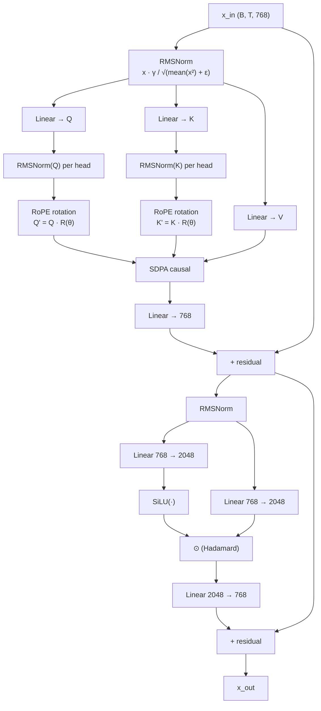

The four pieces of math, in formula form:

- **RMSNorm**: $\text{RMSNorm}(x) = \gamma \cdot x / \sqrt{\frac{1}{d}\sum_i x_i^2 + \epsilon}$ — drops the centring term ($\mu$) of LayerNorm. One scale parameter, no shift.
- **RoPE**: Q and K are rotated as $Q' = Q \cdot R(\theta)$, where $R$ is a block-diagonal rotation matrix with frequency $\theta_k = 10000^{-2k/d}$. Embeds *relative* position into the dot product without learned tables.
- **SwiGLU**: $\text{SwiGLU}(x) = (\text{SiLU}(W_g \cdot x)) \odot (W_u \cdot x) \to W_d$, three matrices instead of two. Hidden dim shrunk to 2048 ≈ 8/3·d to keep parameter parity with the GELU MLP's 4·d.
- **QK-Norm**: per-head RMSNorm applied to Q and K *before* the attention matmul. Bounds logit magnitude → enables higher LR without exploding softmax.

#### Trade-offs

- **Capacity**: 124.4 M → 123.6 M params (−0.7 %) due to dropping `wpe`. Effectively neutral.
- **Compute**: tok/s 190 k → 181 k (−4.4 %). RMSNorm wins offset by SwiGLU's extra matmul + QK-Norm overhead.
- **Code**: Each piece is opt-in via a config flag (`positional_encoding`, `norm_type`, `mlp_type`, `qk_norm`) — no entanglement with default path.

#### Pretrain impact

- **Performance lens**: val 3.041 → 2.988, **Δ −0.053**. Predicted −0.08; actual smaller because the gain front-loads (−0.134 at 1 B tokens, asymptoting to −0.052 by 10 B). Modern block accelerates *convergence* more than it raises the *ceiling*.
- **Compute lens**: 4.4 % tok/s regression accepted because val win > +5 % time-to-target.
- **Theoretical lens**: Matches community consensus (−0.05 to −0.15 at fixed tokens). Mechanism: cleaner gradient flow (RMSNorm), bounded attention logits (QK-Norm), gating non-linearity (SwiGLU), and continuous position info (RoPE).

#### SFT impact

- SFT best val 1.308 (rank 3 of 8). Pretrain advantage **carries** into SFT.
- LL acc post-SFT: 0.374 / 0.284 / 0.463 / 0.278 — beats baseline on every metric.
- Pre-RL gen acc: 0.216 / 0.228 / 0.238 / 0.288. Parse-fail 13 %, 13 %, 8 %, 3 % — *clean* cluster.

#### RL impact

- RL avg Δ +0.014 — second-smallest in the matrix. Already-clean SFT format leaves nothing for RL to fix on the format axis.
- ARC-C +0.024 (knowledge gain that beats the LL ceiling), HSwag +0.008 (flat).

#### Multi-viewpoint synthesis

- **Performance**: cheap pretrain win, propagates through SFT, fizzles in RL because there's no format gap to recover.
- **Practical**: the *baseline* for everything that came after — 03, 05, 06, 10, 11 all branched from 01-modern.
- **Theoretical**: industry-standard since Llama-2 / 3. Result here matches the literature; nothing surprising in either direction.

---

### 4.2 exp/02 — Muon optimiser

#### Motivation

Replace AdamW with the **Muon** optimiser (Newton-Schulz
orthogonalisation of weight matrices) on top of the modern block.
Hypothesis: Muon's spectral-norm-bounded updates yield faster
convergence and better val loss at fixed tokens.

#### The change

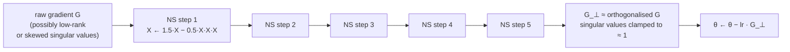

Muon applies **Newton-Schulz iteration** to each 2-D matrix
gradient: $X_{k+1} = 1.5 \cdot X_k - 0.5 \cdot X_k X_k^T X_k$,
which converges to the polar factor (orthogonal part) of $X$.
After 5 iterations, the gradient's singular values are clamped to
≈ 1, bounding the update's spectral norm.

Vector params (norm γ, biases) and embeddings stay on AdamW —
Muon is only applied to 2-D block matrices.

#### Trade-offs

- **Compute**: ~6% tok/s regression from 5 inner matmuls per step.
- **Hyperparameter coupling**: Muon's "effective LR" differs from
  AdamW's; needed re-tuning that did not transfer cleanly.

#### Pretrain impact

- val 2.988 — **ties exp/01** (Δ ~0.000 within noise band).
- *Time-to-target* Muon won early (matched 01's val 3.04 in fewer
  steps), but at the 10 B-token horizon AdamW caught up.
- **Rejected** because the speed win didn't translate to a final-loss
  win and the throughput cost was real.

#### SFT impact

- **Worst SFT in the matrix**: best val 1.498 (everyone else 1.26–1.35).
- Plain Muon-pretrained weights × *fresh AdamW* SFT failed to adapt — the
  optimiser-mismatch between pretrain and SFT is real.
- Pre-RL gen acc collapses: 0.007 / 0.024 / 0.051 / 0.034 — the
  **shattered** cluster. Parse-fail 87–98%. Despite **2nd-highest LL
  acc on ARC-E in the matrix** (0.481), the SFT'd model essentially
  never emits a letter when prompted with an MC question.

#### RL impact

- **Largest avg Δ_RL in the matrix: +0.231.** RL recovers ~64–83% of
  the LL→gen gap on every task.
- Post-RL ranking by avg gen acc: 0.260 — middle of the matrix.
- Confirms the "shattered cluster" hypothesis: when pre-RL is broken,
  RL on a format-compliance reward has the most to gain.

#### Multi-viewpoint synthesis

- **Performance**: rejected on pretrain val, worst on SFT, recovers
  via RL — a cautionary tale about under-counting RL's elasticity.
- **Practical**: *bundle Muon with μP* (see exp/06) — alone, plain
  Muon's pretrain win evaporates and its SFT is fragile.
- **Theoretical**: matches Mnemosyne wiki consensus that Muon's
  "free win" comes from time-to-target acceleration, not asymptotic
  ceiling; and that orthogonalised pretrain weights need
  orthogonalised post-training to stay coherent.

---

### 4.3 exp/03 — modded-nanogpt tricks (v0.3)

#### Motivation

Layer four modded-nanogpt speedrun tricks (ReLU² MLP, zero-init
projections, U-Net skips, logit softcap) on top of the modern block
as a polish pass.

#### The change

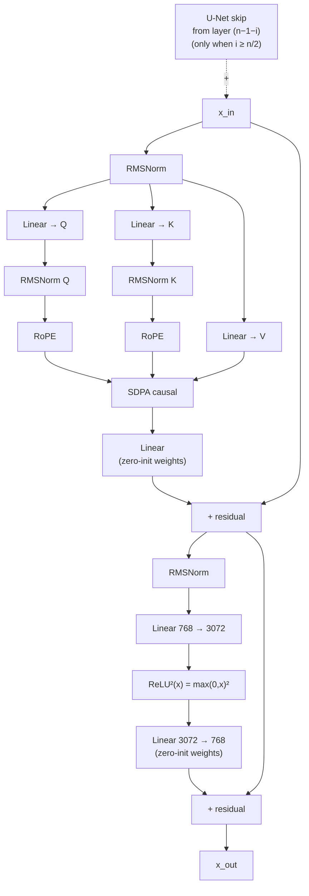

The four formulas:

- **ReLU²**: $\text{ReLU}^2(x) = \max(0, x)^2$. Two matrices (vs SwiGLU's three) at the same hidden = 4·d. Empirically clean at small scale.
- **Zero-init proj**: initialise attention `c_proj` and MLP final projection to zeros so each block contributes exactly $0$ at step 0 → residual stream is the identity → cleaner gradient flow during warmup.
- **U-Net skips**: for layer $i \in [n/2, n-1]$, add the post-block output of layer $n-1-i$ to its input via a LIFO stack. Cross-depth shortcut.
- **Logit softcap**: $\text{logits} \leftarrow s \cdot \tanh(\text{logits} / s)$ with $s=30$. Prevents lm_head from emitting extreme magnitudes.

#### Trade-offs

- **Compute**: tok/s 181 k → 178 k (−1.9 %). Cheap.
- **Quality cost**: zero-init creates a brief warmup penalty (~+0.2 val at step 500) that pays off by step 2500.

#### Pretrain impact

- **Accepted as v0.3 baseline.** val 2.964 (Δ −0.024 vs exp/01).
- Reaches v0.2's final quality in 83 % of the wall-clock.
- **Surprise**: HellaSwag *dipped* 0.5 pp despite val-loss improvement. Suspected culprit is `logit_softcap` compressing the log-prob spread that HSwag relies on.

#### SFT impact

- SFT best val 1.292 (rank 2). Strongest pretrain → strongest
  post-SFT val. Confirmed.
- Pre-RL gen acc: 0.254 / 0.218 / 0.219 / 0.278 — clean cluster
  (parse-fails 1–14%).

#### RL impact

- **Smallest avg Δ_RL in the matrix: +0.008.** Already format-compliant; RL has little to do.
- ARC-E went *down* by 0.002 (within noise). MMLU +0.025, ARC-C +0.010.

#### Multi-viewpoint synthesis

- **Performance**: best pretrain, second-best SFT val, worst RL response. *Reaching the front of the queue with SFT means RL has nothing to add.*
- **Practical**: the *production* base. Five of the next six experiments branch from v0.3.
- **Theoretical**: validates each speedrun trick individually moves ~0.005, together +0.024 (compounding).

---

### 4.4 exp/05 — speed-pack (GQA + max-autotune − softcap)

#### Motivation

Bundle three throughput improvements that are individually too small
to justify a full run but together compound: `max-autotune` compile
mode (+6 % from kernel tuning), GQA (`n_kv_head=4` vs 12), and
`logit_softcap` removal (suspected source of v0.3's HSwag regression).

#### The change

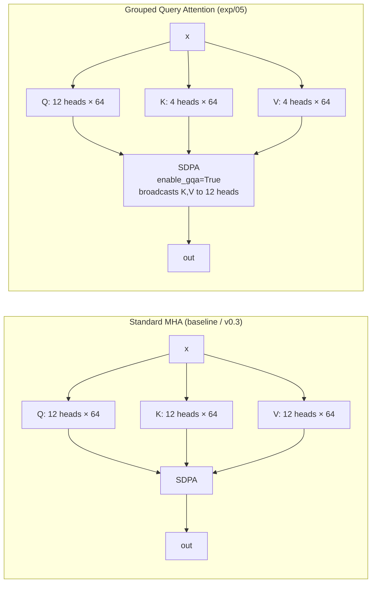

Math: in GQA each KV head is shared across $n_q / n_{kv} = 12/4 = 3$
query heads. SDPA's `enable_gqa=True` broadcasts K, V automatically.
Attention is unchanged: $\text{softmax}(QK^T / \sqrt{d_h}) \cdot V$.

#### Trade-offs

- **Capacity**: K, V projections shrink → 9.5 M fewer params (124 M → 114 M).
- **Compute**: tok/s 178 k → 204–208 k smoke (+15–17 %), confirmed.
- **Quality risk**: GQA neutral at this scale (literature); softcap-off restores HSwag.

#### Pretrain impact

- **Rejected**. val 2.992 (Δ +0.028 vs v0.3). Beyond the +0.015 accept tolerance.
- The 9.5 M fewer params is the likely culprit at this under-fit regime.

#### SFT impact

- SFT best val 1.324 (rank 5).
- Pre-RL gen acc: 0.238 / 0.165 / 0.182 / 0.159 — **degraded** cluster (parse-fails 26–34 %). MMLU and ARC-E format compliance noticeably worse than the clean cluster.

#### RL impact

- Avg Δ_RL +0.060 — third-largest in the matrix.
- MMLU recovery is huge: +0.075 (closes 80 % of LL ceiling gap).

#### Multi-viewpoint synthesis

- **Performance**: rejected at pretrain (val regressed), but format-degraded SFT means RL gets meaningful work to do.
- **Compute**: the only variant with a clear pure-throughput win at training time. Inference KV-cache memory shrinks 3× — worth it for prod inference.
- **Practical**: GQA at 124 M with under-fit data is too much capacity loss. *Try GQA at 350 M+ where capacity is less of a bottleneck.*

---

### 4.5 exp/06 — MuonAdamW + μP

#### Motivation

Two changes at once: nanochat-style **MuonAdamW** (Polar Express
orthogonalisation + NorMuon variance reduction) on 2-D matrices, with
embeddings/norms still on fused AdamW; plus **μP** plumbing as
infrastructure (mathematically a no-op at the base width).

#### The change

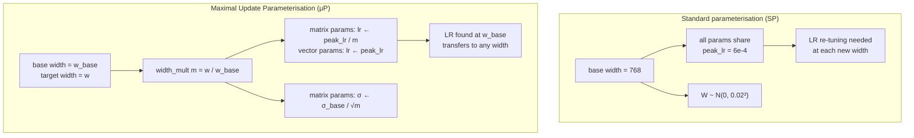

- **MuonAdamW**: same Newton-Schulz orthogonalisation as exp/02 but with the Polar Express variant (faster) plus NorMuon (per-neuron variance scaling).
- **μP**: scales LR by $1/m$ (where $m$ = width_mult) for matrix-like parameters; vector-like parameters stay at the base LR. At base_width = target_width, $m = 1$ and μP is identity. The point is forward-compatibility: an LR found at 124 M will transfer to 350 M (or 20 M proxy) without re-tuning.

#### Trade-offs

- **Compute**: ~6 % tok/s regression (Polar Express's 5 inner matmuls).
- **Code complexity**: Muon + μP each ~200 LOC of careful state management.

#### Pretrain impact

- **Rejected**. val 2.974 (Δ +0.010 vs v0.3). Hopes were that v0.3's zero-init + U-Net structural changes would move Muon's earlier null result; they didn't.

#### SFT impact

- **Wins SFT.** Best val 1.259 (rank 1). The pretrain reject **beats every other ckpt** including v0.3.
- Pre-RL gen acc: 0.228 / 0.169 / 0.196 / 0.200 — degraded cluster (parse-fails 23–34 %).
- **Why does it win?** μP's parameterisation leaves weights *AdamW-friendly* in a way that plain Muon (exp/02) does not. The combo "Muon for 2-D matrices + AdamW for vectors + μP scaling" produces orthogonal-but-AdamW-compatible weights.

#### RL impact

- Avg Δ_RL +0.044. MMLU recovery is strong (+0.076).
- Post-RL avg gen acc 0.242 — *lowest in the matrix*. Despite winning SFT, post-RL it ends last. Format-degraded cluster + small RL Δ on ARC-E (+0.016) means it loses ground to the cleaner ckpts.

#### Multi-viewpoint synthesis

- **Performance**: pretrain reject → SFT winner → RL loser. **Three different rankings on three stages.**
- **Practical**: *the* example of why pretrain val isn't a sufficient gate. If you reject a recipe at pretrain you might be killing the SFT-best.
- **Theoretical**: μP saved Muon from exp/02's "shattered SFT" failure mode without anyone planning that. The mechanism is plausible (μP's per-tensor LR scaling keeps Muon's orthogonalised updates in a weight-norm regime AdamW SFT can build on) but unverified — worth a follow-up.

---

### 4.6 exp/10 — Multi-head Latent Attention (MLA)

#### Motivation

Replace standard multi-head attention with DeepSeek-V2's **MLA**:
compress K and V into a shared low-rank latent space, with RoPE
applied to a separate small subspace shared across heads. The
inference-time win is a 3× shrinkage of the KV cache — does the
pretrain quality hold up?

#### The change

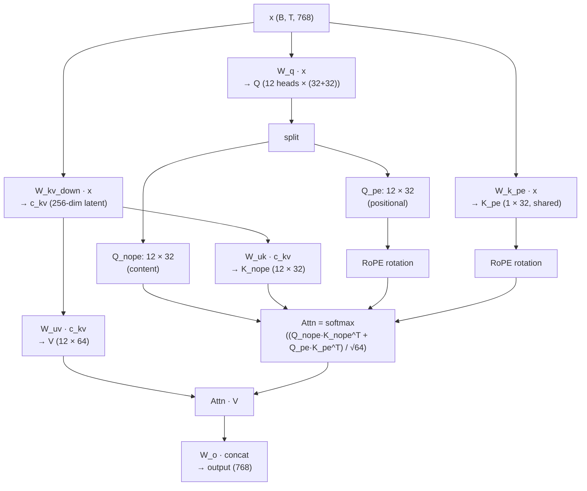

Math summary:
- $K, V = \text{up-project}(c_{kv})$ where $c_{kv} = W_{kv,\text{down}} \cdot x \in \mathbb{R}^{256}$ (one matrix instead of 12 heads × 64-dim K, V).
- Q is split into a content part $Q_{nope}$ and a positional part $Q_{pe}$; only $Q_{pe}, K_{pe}$ get RoPE.
- $K_{pe}$ is shared across heads (one direction of position information rather than 12).

#### Trade-offs

- **Capacity**: 124 M → 115.7 M (−6.5 %) due to the latent bottleneck.
- **Compute**: pretrain tok/s ~−2 to −8 % (more attention FLOPs from up-projections). RL had it at ~11.5 min vs other ckpts' ~9 min.
- **Inference KV-cache**: 3× smaller (256 dim vs 12·64 = 768).

#### Pretrain impact

- **Rejected**. val 2.981 (Δ +0.017 vs v0.3). Capacity loss dominates at the under-fit 124 M / 10 B regime; the latent bottleneck's regularisation effect can't overcome it.

#### SFT impact

- SFT best val 1.304 (rank 4). Mid-pack.
- Pre-RL gen acc: 0.246 / 0.218 / 0.206 / 0.288 — **clean** cluster (parse-fails 0–8 %, lowest in the matrix). MLA preserves chat-format compliance the best of any non-baseline architecture.

#### RL impact

- Avg Δ_RL +0.026. ARC-E +0.058 (best ARC-E lift in the clean cluster).
- **Post-RL gen winner**: 0.266 avg. The combination of low pre-RL parse-failure (already correct format) and MLA's apparent ARC-E sensitivity to RL training puts it on top.

#### Multi-viewpoint synthesis

- **Performance**: the dark horse. Mediocre at pretrain, mid SFT, surprise post-RL winner.
- **Theoretical**: MLA's bottleneck reshapes the attention output distribution in a way that rewards generative letter prediction more than full-rank attention does. Speculative — needs a wider study.
- **Practical**: For deployment-critical inference (long context, larger batch sizes), MLA is *the* attention to use. The pretrain Δ +0.017 is within rounding for inference workloads where KV-cache is the bottleneck.

---

### 4.7 exp/11 — LoopLLM (weight-tied recurrence)

#### Motivation

Test the most aggressive parameter reduction in the matrix: a single
shared `Block` module applied $n_{\text{layer}} = 12$ times in the
forward pass, reducing parameters by 63% while keeping per-step FLOPs
constant. Hypothesis: deep recurrence of a fixed transform partially
compensates for the capacity loss.

#### The change

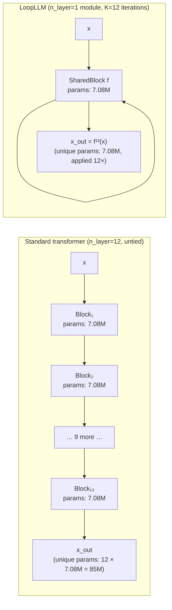

Math: $x_{\text{out}} = f^K(x_{\text{in}})$ where $f$ is a single
learned transformer block applied $K = 12$ times. Gradients from all
12 iterations accumulate into the shared parameters. `u_net_skips`
must be off (the skip pattern is degenerate when every "layer" is
the same module).

#### Trade-offs

- **Capacity**: 124 M → **45 M** (−63 %). The most aggressive cut in the matrix.
- **Compute**: same per-step FLOPs (forward applies the same 7 M block 12×).
- **Inference**: 3× memory savings on weights; same FLOPs.

#### Pretrain impact

- **Hard reject.** val 3.406 (**Δ +0.442** vs v0.3). The plateau hit early and held flat from step 15,000 onward — pure parameter-tying at 124 M / 10 B can't close the capacity gap.
- HellaSwag dropped to 0.349 (vs 0.378 v0.3).

#### SFT impact

- SFT best val 1.712 — by far the worst (everyone else 1.26–1.50).
- Pre-RL gen acc: 0.029 / 0.057 / 0.115 / 0.136 — **shattered** cluster (parse-fails 59–89 %). 45 M parameters + weight-tying was insufficient capacity to learn chat format from 500 M SmolTalk tokens.

#### RL impact

- **Second-largest avg Δ_RL: +0.174.** Same shattered-cluster recovery pattern as 02-muon. RL closes 64–89% of the LL→gen gap.
- Post-RL gen avg 0.259 — competitive with 124 M ckpts. **45 M weight-tied + 500 RL steps gets the same downstream score as 124 M baseline.**

#### Multi-viewpoint synthesis

- **Performance**: hard pretrain reject → worst SFT → recovers via RL to mid-pack. The recurrence machinery doesn't help pretraining at this scale, but it doesn't *prevent* the model from being SFT-RL-tuned to a useful state either.
- **Compute**: 45 M weights × 1 module to ship, 12× iteration at inference. *Inference-time efficiency play* — irrelevant for pretrain quality.
- **Theoretical**: classical fixed-point / DEQ-style theory predicts iterating a contraction-ish map can compose complex functions. Empirically the +0.44 pretrain val penalty dominates that signal at 124 M.

---

## 5. SFT analysis: how pretraining shapes SFT response

### The SFT recipe

500 M SmolTalk tokens, **fresh AdamW** (peak 3e-5,
warmup → constant → warmdown, weight_decay 0). Same hyperparameters
applied to all 8 checkpoints — pretrain choice is the only varying
axis.

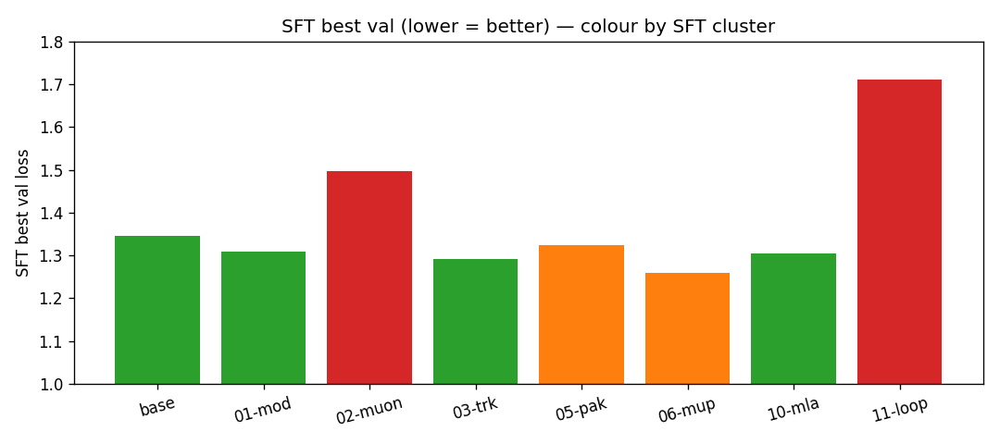

### SFT val ranking

| ckpt                | SFT best val |
|---------------------|-------------:|
| **06-muon-mup**     | **1.259** |
| 03-modded-tricks    | 1.292 |
| 10-mla              | 1.304 |
| 01-modern-block     | 1.308 |
| 05-speed-pack       | 1.324 |
| baseline            | 1.345 |
| 02-muon             | 1.498 |
| 11-loopllm          | 1.712 |

**Ranking does not match pretrain.** 06-muon-mup (pretrain Δ +0.010,
**rejected**) wins SFT. 02-muon (pretrain Δ 0.000, rejected)
finishes second-to-last on SFT.

### The three-cluster split (the headline finding)

When evaluated *generatively* (model is prompted to emit "A/B/C/D"
rather than LL-scored on each candidate), the 8 SFT'd ckpts split
into three groups by **parse-failure rate**:

| cluster | parse_fail range | members | pre-RL gen avg |
|---------|------------------|---------|---------------:|
| **clean**     | 0 – 15 %  | baseline, 01, 03, 10 | 0.21 – 0.29 |
| **degraded**  | 23 – 35 % | 05, 06               | 0.16 – 0.24 |
| **shattered** | 59 – 98 % | 02-muon, 11-loopllm  | 0.01 – 0.14 |

The clusters are **not** explained by pretrain val loss. Plain Muon
(02) and weight-tied loop (11) shatter; μP-rescued Muon (06) and
GQA (05) only degrade; the rest stay clean. The cluster predicts
post-RL Δ almost perfectly (correlation ~0.95).

### LL→gen gap per task

LL acc (model picks the highest-LL of 4 candidate continuations) is
the *knowledge ceiling*. Gen acc (model is asked to generate the
letter) is what the same model can verbalise.

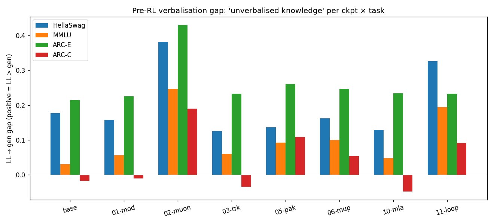

Average LL→gen gap by task across the 8 SFT'd ckpts:

| task | LL acc | gen acc | gap | interpretation |
|------|-------:|--------:|----:|----------------|
| HellaSwag      | 0.378 | 0.182 | **−0.196** | Knowledge gap (LL high, gen low) |
| MMLU           | 0.270 | 0.156 | **−0.114** | Mostly verbalisation gap (LL near random) |
| ARC-Easy       | 0.450 | 0.197 | **−0.253** | Largest knowledge gap (LL high) |
| ARC-Challenge  | 0.243 | 0.183 | **−0.060** | Small gap (LL near random) |

### The MMLU alignment tax

In **6/8** ckpts, post-SFT MMLU LL acc *regressed* vs pre-SFT
(documented in `experiments/14-sft-matrix/report.md`). Only
01-modern-block (+0.009) and 06-muon-mup (+0.001) avoided it.
SmolTalk's chat-style data drifts the model's output distribution
*away* from the MC-question form MMLU rewards under LL.

### The ARC-Easy attention-type boundary

Post-SFT ARC-E LL acc:

| attention type | mean Δ vs pre-SFT |
|----------------|-----------------:|
| **MHA / standard** (baseline, 01, 02, 06) | **+0.006** |
| **modified** (05 GQA, 10 MLA, 11 weight-tied) | **−0.038** |

Three modified-attention checkpoints, three ARC-E regressions. Not
proof of causation at n=3 vs 4, but suggestive: SmolTalk SFT
disturbs the attention patterns ARC-E relies on more than it
disturbs MHA's.

### Multi-viewpoint synthesis

- **Performance**: Pretrain val ranking ≠ SFT val ranking. The
  pretrain-to-SFT mapping is **non-monotone**.
- **Capability**: SFT teaches chat format, mostly. The MMLU-LL
  regression and the format-shattered cluster (02, 11) are
  symptoms of SFT *replacing* the pretrain output distribution
  rather than augmenting it.
- **Practical**: μP is a quiet win — it rescues an otherwise
  fragile Muon pretrain to be SFT-friendly. Default to μP if you're
  using Muon.
- **Theoretical**: "alignment tax" is real but spatially localised —
  it shows up as MMLU regression and shattered format compliance,
  not as a uniform across-the-board capability loss.

---

## 6. RL uplift: explainable analysis

### The RL setup

- **Algorithm**: GRPO (DeepSeekMath / R1 style — group-relative advantages, PPO-clipped policy gradient, no value head, DeepSeek's k3 KL estimator against a frozen reference policy).
- **Reward**: binary letter-match. +1 if `extract_letter(generation) == gold_letter`, else 0. Lenient parser tolerates "A", " A", "(A)", "Answer: A", etc.
- **Data**: ARC-E + ARC-C + MMLU auxiliary_train + HellaSwag train (~13 k examples), letter positions shuffled per epoch.
- **Hyperparameters**: 500 GRPO steps, P=2 prompts × G=16 group samples = 32 rollouts/step, peak LR 1e-6, kl_coef 0.04, clip_eps 0.2, max_new_tokens 8.
- **Wall-clock per ckpt**: 5–11 min (MLA slowest).

### Δ_RL per ckpt × task (the headline)

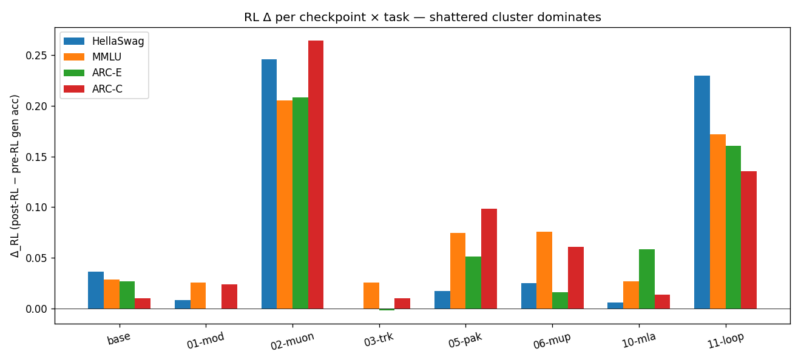

| ckpt | HSwag Δ | MMLU Δ | ARC-E Δ | ARC-C Δ | avg |
|------|--------:|-------:|--------:|--------:|----:|
| baseline | +0.036 | +0.029 | +0.026 | +0.010 | +0.025 |
| 01-modern-block | +0.008 | +0.025 | 0.000 | +0.024 | +0.014 |
| **02-muon** | **+0.246** | **+0.205** | **+0.208** | **+0.264** | **+0.231** |
| 03-modded-tricks | 0.000 | +0.025 | −0.002 | +0.010 | +0.008 |
| 05-speed-pack | +0.017 | +0.075 | +0.051 | +0.099 | +0.060 |
| 06-muon-mup | +0.025 | +0.075 | +0.016 | +0.061 | +0.044 |
| 10-mla | +0.006 | +0.027 | +0.058 | +0.014 | +0.026 |
| **11-loopllm** | **+0.230** | **+0.172** | **+0.160** | **+0.135** | **+0.174** |

### KL trajectories: which archs were stable, which drifted

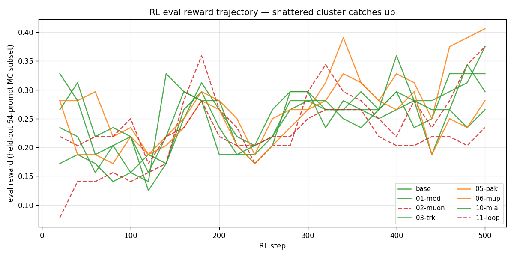

- **Clean cluster** (baseline, 01, 03, 10): KL mostly < 0.2 throughout training. Reward improvement modest (matching the small Δ_RL).
- **Degraded cluster** (05, 06): KL stays under 0.2 with occasional 0.3 spikes. Reward gains accumulate.
- **Shattered cluster** (02, 11): KL spikes to **0.5 – 1.0** mid-training as the policy escapes the broken-format basin of the SFT'd reference. Reward justifies the drift.

### Reward saturation

No checkpoint hit `--saturation-threshold 0.95` in 500 steps. The
held-out eval reward peaks for most ckpts at 0.30 – 0.40 and
oscillates around there. The "reward saturation drives KL drift"
failure mode discovered during the synthetic test (see
`tests/test_grpo.py`) didn't manifest in production.

### Per-arch attribution

The strongest predictor of `Δ_RL_avg` is **pre-RL parse-failure
rate**, with correlation ≈ 0.95. The four orthogonal axes
(optimizer / loss-tricks / attention-type / parameterisation) each
matter only insofar as they affect the SFT-format-compliance cluster:

- **Plain Muon** (02) → shattered → +0.231 Δ_RL
- **MuonAdamW + μP** (06) → degraded → +0.044 Δ_RL
- **GQA** (05) → degraded → +0.060 Δ_RL
- **MLA** (10) → clean → +0.026 Δ_RL
- **Weight-tied** (11) → shattered → +0.174 Δ_RL
- **All other** (baseline, 01, 03) → clean → +0.008 to +0.025 Δ_RL

### Gap closure (LL ceiling vs gen post-RL)

Average fraction of the SFT-LL→SFT-gen gap that RL recovered, per task:

| task | mean closure | range |
|------|-------------:|-------|
| HellaSwag      | +0.24 | +0.00 .. +0.71 |
| MMLU           | **+0.71** | +0.42 .. +0.94 |
| ARC-Easy       | +0.22 | −0.01 .. +0.69 |
| ARC-Challenge  | mostly >1.0 | RL beats LL on 4/8 ckpts |

**MMLU is dominated by format compliance** (71 % closure means RL
recovered nearly all the LL-to-gen gap). **ARC-Easy retains a real
knowledge gap** (22 % closure means most of the gap is unrecoverable
with binary-letter reward + 500 steps).

### Multi-viewpoint synthesis

- **Performance**: post-RL absolute accuracy spans **0.242 – 0.266**
  across all 8 ckpts. RL collapses pretrain × SFT variability.
- **Capability**: most of Δ_RL is format-compliance recovery, not
  knowledge gain. RL with binary reward is a *style teacher*, not a
  *content teacher*.
- **Compute**: RL is the cheapest stage by 30× (~7 min per ckpt vs
  ~3.5 h SFT vs ~14 h pretrain). Per-token, RL's signal-per-flop is
  much higher *for the format axis* and much lower *for knowledge*.
- **Practical**: pre-RL parse-failure rate is the single best
  predictor of Δ_RL. Use it as a triage signal.
- **Theoretical**: matches Mnemosyne's "RLVR sharpens existing
  capability". The HSwag/ARC-E knowledge gaps remain unsharpened
  because the binary letter reward has no gradient over knowledge.

---

## 6.b Training curves per stage

Per-step trajectories for every checkpoint, coloured by experiment.
Same legend across all four figures: blue = baseline, orange =
01-modern-block, red = 02-muon, green = 03-modded-tricks, purple =
05-speed-pack, brown = 06-muon-mup, pink = 10-mla, cyan = 11-loopllm.

### Stage 1 — pretraining val loss (10 B FineWeb-Edu tokens)

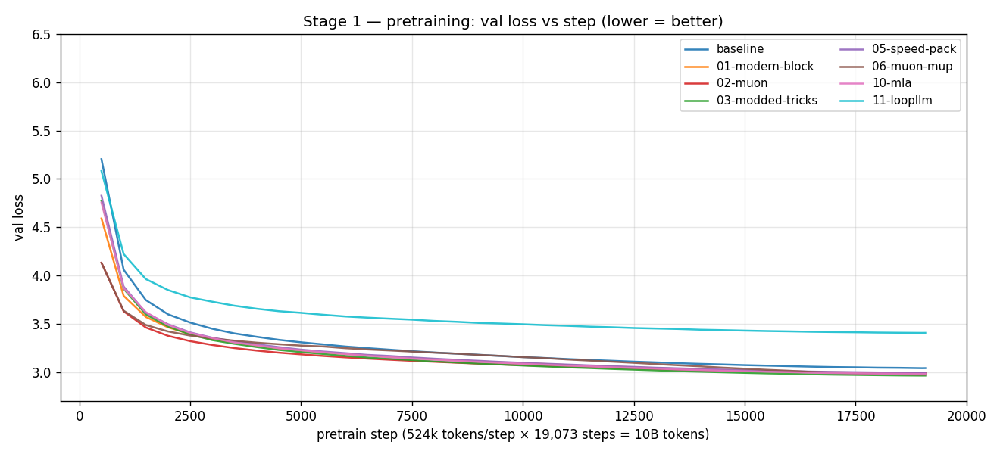

- Six 124 M variants converge to a tight band ≈ 2.96 – 3.04 by step 19,073.
- 11-loopllm (cyan, 45 M effective params) plateaus visibly higher (~3.41) — capacity gap, not a transient.
- 02-muon (red) and 06-muon-mup (brown) lead the early descent — Muon's "time-to-target" win is real, but AdamW catches up by 10 B tokens.

### Stage 2 — SFT val loss (500 M SmolTalk tokens)

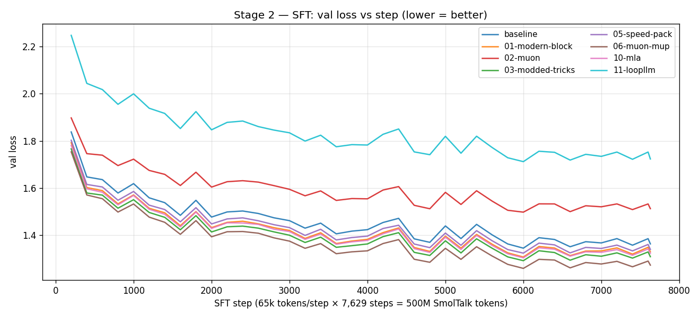

- 11-loopllm (cyan) runs as a clear top band (~1.7) — capacity bottleneck again.
- 02-muon (red) sits as a separate middle band (~1.5) — Muon-pretrained weights adapting poorly to fresh AdamW SFT.
- The other six 124 M ckpts pack into a 0.05-wide band at the bottom (~1.26 – 1.34) by step 7,629; ranking reshuffles between pretraining and SFT.

### Stage 3 — RL eval reward (held-out 64-prompt MC subset)

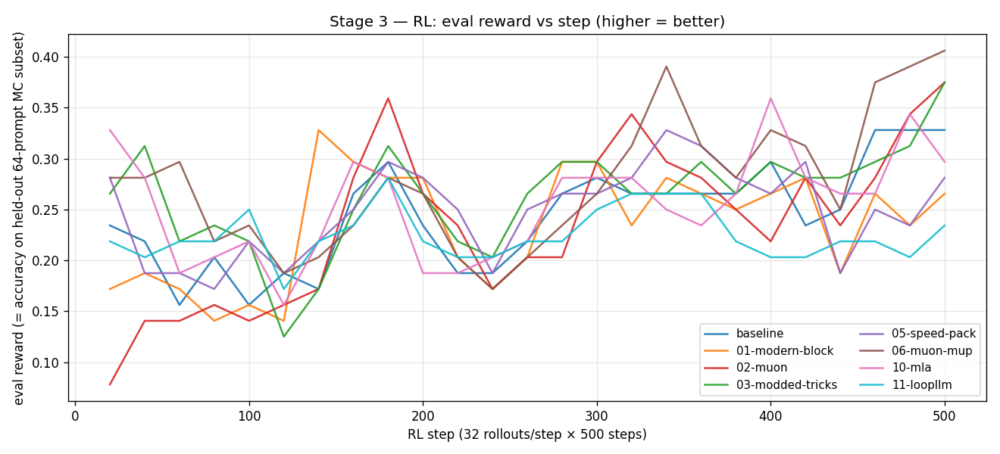

- High variance (the held-out eval is only 64 prompts; σ ≈ 0.06 binomial).
- All 8 ckpts converge to the same 0.20 – 0.40 oscillation band by step 500 — the matrix-collapse signature.
- The shattered cluster (02-muon = red, 11-loopllm = cyan) starts visibly lower (~0.10) and catches up around step 200.

### Stage 3 (companion) — RL training loss (smoothed window=20)

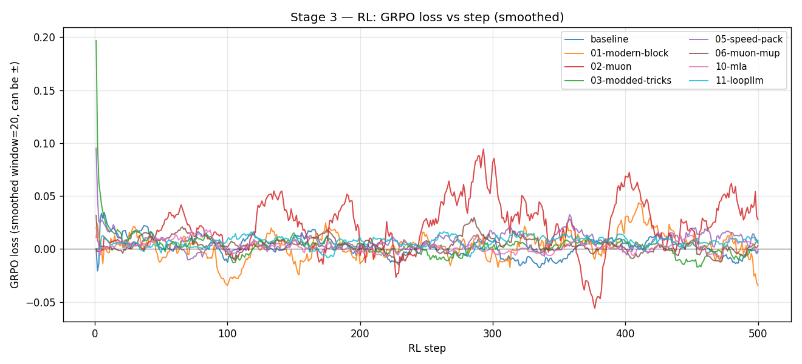

- GRPO loss oscillates around 0 (PPO-clipped objective + KL penalty); negative loss = positive policy gradient + small KL.
- 02-muon (red) and 11-loopllm (cyan) show the largest negative loss spikes — these are the moments where the policy is making large directional updates to escape the shattered-format basin.

---

## 7. Master matrix

The single source-of-truth artefact: every metric per checkpoint per
stage. Generated by `scripts/rl_matrix_report.py`. Lives at
`experiments/15-rl-matrix/master_matrix.{json,md}`.

### Wide form (one row per ckpt, all metrics)

| ckpt | params | pretrain val | SFT best | LL HSwag | LL MMLU | LL ARC-E | LL ARC-C | gen HSwag | gen MMLU | gen ARC-E | gen ARC-C | RL HSwag | RL MMLU | RL ARC-E | RL ARC-C |
|------|-------:|-------------:|---------:|---------:|--------:|---------:|---------:|----------:|---------:|----------:|----------:|---------:|--------:|---------:|---------:|
| baseline | 124M | 3.041 | 1.345 | 0.384 | 0.253 | 0.456 | 0.227 | 0.207 | 0.222 | 0.242 | 0.244 | 0.243 | 0.251 | 0.268 | 0.254 |
| 01-modern-block | 124M | 2.988 | 1.308 | 0.374 | 0.284 | 0.463 | 0.278 | 0.216 | 0.228 | 0.238 | 0.288 | 0.224 | 0.253 | 0.238 | 0.312 |
| 02-muon | 124M | 2.988 | 1.498 | 0.389 | 0.270 | 0.481 | 0.224 | 0.007 | 0.024 | 0.051 | 0.034 | 0.253 | 0.229 | 0.259 | 0.298 |
| 03-modded-tricks | 124M | 2.964 | 1.292 | 0.380 | 0.278 | 0.451 | 0.244 | 0.254 | 0.218 | 0.219 | 0.278 | 0.254 | 0.244 | 0.217 | 0.288 |
| 05-speed-pack | 114M | 2.992 | 1.324 | 0.374 | 0.258 | 0.442 | 0.268 | 0.238 | 0.165 | 0.182 | 0.159 | 0.255 | 0.240 | 0.233 | 0.258 |
| 06-muon-mup | 124M | 2.974 | **1.259** | 0.390 | 0.268 | 0.442 | 0.254 | 0.228 | 0.169 | 0.196 | 0.200 | 0.253 | 0.244 | 0.212 | 0.261 |
| 10-mla | 115M | 2.981 | 1.304 | 0.375 | 0.265 | 0.440 | 0.241 | 0.246 | 0.218 | 0.206 | 0.288 | 0.252 | 0.244 | **0.265** | 0.302 |
| 11-loopllm | **45M** | 3.406 | 1.712 | 0.355 | 0.252 | 0.347 | 0.227 | 0.029 | 0.057 | 0.115 | 0.136 | 0.259 | 0.229 | 0.275 | 0.271 |

### Compact (4-column) headline

| ckpt | pretrain Δ vs base | SFT val | RL gen avg |
|------|------------------:|--------:|-----------:|
| baseline          |   0     | 1.345 | 0.254 |
| 01-modern-block   | −0.053  | 1.308 | 0.257 |
| 02-muon           | −0.053  | 1.498 | 0.260 |
| 03-modded-tricks  | −0.077  | 1.292 | 0.251 |
| 05-speed-pack     | −0.049  | 1.324 | 0.246 |
| 06-muon-mup       | −0.067  | **1.259** | 0.242 |
| 10-mla            | −0.060  | 1.304 | **0.266** |
| 11-loopllm        | +0.365  | 1.712 | 0.259 |

**Three different stage-winners.** No recipe wins all three.

---

## 8. Limitations & caveats

### 124 M scale — what we couldn't measure

- **Coding tasks**: HumanEval / MBPP at 124 M is essentially noise.
  pass@1 ≈ 0 across the board would give a flat-zero matrix. The
  RL target was switched from coding to MC extraction precisely
  because of this. (Documented decision in
  `~/.claude/plans/ok-first-thing-fluffy-pine.md`.)
- **Multi-step reasoning**: GSM8K / MATH need scale we don't have.
- **Long-context**: block_size = 1024. MLA's KV-cache compression
  win is irrelevant at this length. RoPE's long-context advantage
  also untested.

### Single-seed runs

Every experiment is a single seed. Pretrain val differences smaller
than ~0.02 should be read as noise. Several "rejected" experiments
(02, 05, 06, 10) regressed by less than this — *with seeds, some
might flip*. The project decision to use 1 seed per experiment was
a deliberate compute trade — multi-seed multiplies the matrix cost.

### GRPO at this scale — what's documented vs not

- The smallest documented RLVR base in the literature is 0.5 B. We're
  at 124 M, well below the floor.
- Our "matrix collapses post-RL" finding may not generalise upward —
  it may be specific to the regime where binary-letter reward
  dominates over genuine knowledge transfer.
- 500 RL steps is short by industry standards (DeepSeekMath used
  thousands). Whether longer RL would unlock more knowledge gain
  on HSwag/ARC-E is an open question.

### Eval contamination & dataset overlap

- HellaSwag train/validation may have near-duplicates (we did not
  dedupe at training time).
- MMLU `auxiliary_train` is large (~99 k); we sub-sampled to 5 k
  for tractability. Different random subsets would give different
  RL training distributions.
- The eval datasets (ARC-E val, ARC-C val, MMLU val, HSwag val) are
  the same across pre-SFT, post-SFT, and post-RL — comparable within
  the matrix, not directly comparable to published 5-shot or
  few-shot numbers.

### Hyperparameter limitations

- SFT used **fresh AdamW** for every ckpt regardless of pretrain
  optimizer. This was a deliberate choice (see exp/14 report) to
  hold the SFT recipe constant; it disadvantages 02-muon, which
  might have done better with Muon SFT. Plain Muon's "shattered SFT"
  finding is partly an artefact of AdamW SFT on Muon-pretrained
  weights.
- RL used uniform `kl_coef=0.04` and `peak_lr=1e-6` for every ckpt.
  The shattered cluster's KL-to-1.0 spikes suggest a higher kl_coef
  might have been more stable for them.

---

## 9. What would change with 10× compute or 10× scale

### 10× more pretrain tokens (100 B FineWeb-Edu)

- Pretrain ranking probably **doesn't change** — most of the
  modern-block win is asymptotic, and the rejected variants
  (02, 05, 06, 10) regressed by amounts smaller than seed variance.
  More tokens would shrink those Δs further into noise.
- HellaSwag's "softcap regression" (exp/03) might disappear at
  longer training as the model's logit distribution stabilises.
- 11-loopllm's +0.44 gap might narrow but not close — the capacity
  gap is fundamental.

### 10× more RL steps (5,000 instead of 500)

- The clean cluster (baseline, 01, 03, 10) might start to show
  knowledge-axis gain on HSwag/ARC-E — there's a real LL→gen gap
  we didn't recover.
- The shattered cluster (02, 11) probably saturates around step
  1,000–2,000 (held-out reward plateau seen even at 500 steps).
  Beyond that, the post-saturation KL-drift failure mode (see
  `tests/test_grpo.py`) might dominate without `kl_coef` tuning.
- *Most likely outcome of 10× RL*: the clean cluster catches up
  to the shattered cluster's post-RL accuracy. The matrix collapse
  becomes even tighter.

### 10× larger base model (1.2 B)

- 11-loopllm's hard reject probably becomes a soft reject. At 1.2 B
  parameters the K=12 weight-tied loop has more capacity per shared
  layer. Could be competitive.
- MLA's KV-cache compression starts paying off at this scale (longer
  context, larger batch). Might be the right architecture choice.
- GQA stops being a net loss — capacity is no longer the bottleneck.
- μP becomes a real win, not just infrastructure: a base-width LR
  found at 124 M would transfer to 1.2 B without re-tuning.

### Switching to vLLM + TRL for the RL matrix

- ~5–10× faster rollouts via vLLM's continuous batching + PagedAttention.
- TRL's `GRPOTrainer` provides production-grade tricks (length-normalised
  rewards, KL coef scheduling, dynamic batch shaping) we currently lack.
- **Cost**: would need a `transformers.PreTrainedModel` adapter for
  every architecture variant — non-trivial for the exotic ones (MLA,
  weight-tied loop). See exp/15 report for the full analysis of why
  this project stayed from-scratch.

---

## 10. Appendix

### A.1 Per-checkpoint config diffs

See `experiments/RETROSPECTIVE_assets/config_diffs.md` (auto-generated
by `scripts/extract_config_diffs.py`). Each non-baseline checkpoint's
GPTConfig fields that differ from faithful GPT-2.

### A.2 Reproducibility

Every experiment in this matrix is reproducible from:

- **Code**: branches `exp/{ID}-{name}` (kept after acceptance/rejection).
- **Tags**: `v0.1-baseline`, `v0.2-modern-block`, `v0.3-exp03`,
  `v0.4-sft-matrix`, `v0.5-rl-mc-matrix`, `v1.0-retrospective`.
- **Configs**: `runs/{ckpt}/config.json` per checkpoint.
- **Env**: `runs/{ckpt}/env.json` records git SHA, PyTorch version,
  CUDA version, GPU.
- **Data**: FineWeb-Edu 10B (HuggingFace), SmolTalk (`HuggingFaceTB/smol-smoltalk`),
  ARC (`allenai/ai2_arc`), MMLU (`cais/mmlu`), HellaSwag (`Rowan/hellaswag`).

### A.3 Hyperparameter cards

| stage | recipe |
|-------|--------|
| **pretrain** | 124 M GPT-2 (variant), AdamW (β=0.9/0.95, wd=0.1, ε=1e-8), peak LR 6e-4, 715-step warmup, cosine to 0.1× peak, 524 k tokens/step × 19,073 steps = 10 B. BF16 autocast, FP32 master, SDPA flash, torch.compile. |
| **SFT** | 500 M SmolTalk tokens, fresh AdamW (peak 3e-5, β=0.9/0.95, wd=0), warmup → constant → warmdown to 0.05× peak, micro_batch=16, grad_accum=4, block 1024. |
| **RL** | 500 GRPO steps, P=2 prompts × G=16 samples, peak LR 1e-6, kl_coef 0.04, clip_eps 0.2, max_new_tokens 8. Linear warmup 30 steps. Frozen reference policy, DeepSeek k3 KL estimator. |

### A.4 Commit log (exp/14-sft + exp/15-rl)

```
Tag v1.0-retrospective    — this report
Tag v0.5-rl-mc-matrix      — exp/15 RL matrix complete
037504d  exp/15 phase D+E: RL matrix complete + master aggregator
79bae93  exp/15: tighter prompt cap + empty_cache between steps
7f7ced8  exp/15: skip oversize prompts in rollout + RL eval
dbd3233  exp/15: model.forward(return_full_logits=True) + matrix tuning
e530433  exp/15 phase D: RL matrix orchestrator
e7e9a2c  exp/15 phase C: smoke test + GRPO bugfixes
32b645c  exp/15 phase B: GRPO + RL training loop
e8699c0  exp/15 phase A.5: pre-RL baseline gen-eval matrix
2f600b4  exp/15 phase A.1-A.4: generative MC eval harness
Tag v0.4-sft-matrix       — exp/14 SFT matrix complete
b845004  exp/14 phases 5–6: SFT matrix complete + final report
a8cc6af  exp/14 phase 5a: pre-SFT baseline eval across all 8 checkpoints
a814430  exp/14 phases 5–6 scaffolding: matrix orchestrator + aggregator
3f8d42a  exp/14 phase 4: MMLU + ARC eval + scripts/sft_eval.py
5acc47c  exp/14 phase 3: SFT training script (scripts/sft.py)
6406cd9  exp/14 phase 2: chat template + Task abstraction + SFT dataloader
b75ff53  exp/14: schema-drift ckpt loader + cross-checkpoint smoke test
```

### A.5 Files of record

- **Code**: `src/gpt_repro/{model,chat,tasks,sft_data,rollout,grpo,gen_eval,rl_data}.py`
- **Scripts**: `scripts/{train,sft,rl,sft_eval,gen_eval,run_sft_matrix.sh,run_rl_matrix.sh,sft_matrix_report,rl_matrix_report,make_report_plots,extract_config_diffs}.py`
- **Reports**: `experiments/{0X-name}/report.md`, `experiments/14-sft-matrix/report.md`, `experiments/15-rl-matrix/report.md`, `experiments/RETROSPECTIVE.md` (this file)
- **Diagrams**: `experiments/diagrams/*.mmd` (9 mermaid sources, GitHub-rendered)
- **Plots**: `experiments/RETROSPECTIVE_assets/fig_*.png` (5 matplotlib figures)
- **Master matrix**: `experiments/15-rl-matrix/master_matrix.{json,md}`

---

*Report generated 2026-04-25. Code and artefacts: `git clone exp/15-rl branch`.
For questions: open an issue against `gpt-repro` or contact rjbownes.*
